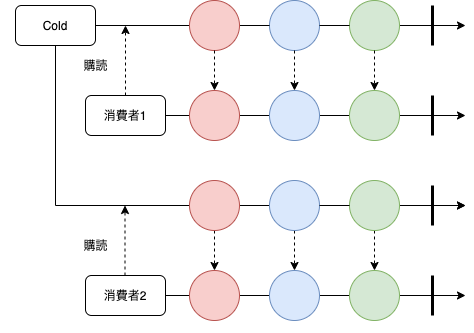
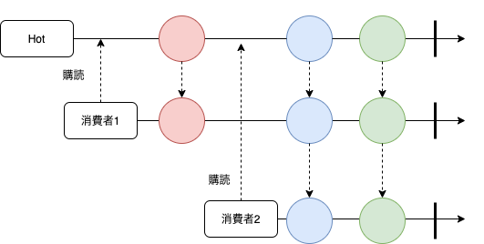

# LiveData, Flow
## 本日の目的
* レスポンシブかつ安全なUI表現のために開発されたLiveData、その発展であるFlowのメリット、デメリットを理解し、基本的な使い方を学ぶ
* Reactive Streamsの概要を理解する

※ 今回の資料では、一部[Kotlin Playground](https://play.kotlinlang.org/)を使用しています。

## リアクティブプログラミングとは
* 通知されてくるデータを受け取るたびに関連したプログラムが反応して処理を行うプログラミングの考え方

## Reactive Streams
https://github.com/reactive-streams/reactive-streams-jvm#reactive-streams

### 基本的な構成
- Publisher(生産者): データを通知する
- Subscriber(消費者): データを受け取り、処理する


1. Publisher が通知する準備が整ったことを Subscriber へ通知する（onSubscribe）
2. Subscriber は受け取るデータ数を併せてリクエストを送る（Subscription#request）
3. Publisher はデータ数分データを生成し、データを通知する（onNext）
4. Subscriber は通知されたデータをもとに処理を行い、再び Publisher へリクエストを送る（Subscription#request）
5. Publisher はデータを通知する（onNext）
6. これを完了（onComplete）もしくはエラーが起きる（onError）まで続ける

PublisherとSubscriberは以下の4つのプロトコルを通じてデータ通知を行なっています。

|プロトコル|説明|
|--|--|
|onSubscribe|通知の準備ができたことを通知|
|onNext|データを通知|
|onError|エラー(異常終了)を通知|
|onComplete|完了(正常終了)を通知|

Reactive Streamsでは4つのインターフェースが用意されています

|インターフェース|説明|
|--|--|
|Publisher|データを通知する|
|Subscriber|データを受け取り、処理する|
|Subscription|データ数のリクエスト、購読の解除を行う|
|Processor|Publisher, Subscriber両方の性質を持つ|

※インターフェースの中身はこちら

https://github.com/reactive-streams/reactive-streams-jvm/tree/v1.0.3/api/src/main/java/org/reactivestreams

Reactive Streamsを使う上で重要なルール
- 購読開始の通知はその購読で1度しか通知されない
- 通知は逐次的に行われる(複数の通知を同時に行わなれない)
- nullを通知しない
- Publisherの処理は完了、もしくはエラーを通知することで終了する

### オペレータ
RxJavaやFlowなどでは生産者が通知したデータが消費者に届くまでに、使いやすいように変換したり、不要なデータを破棄したりと通知のデータを操作することがよくあります。この操作をする際に使われるメソッドのことを**オペレータ**といいます。

また、オペレータのドキュメントで以下のような図が出てきます。この図のことを**マーブルダイアグラム**と言い、時間と共にどのようにデータが受け渡され、どのように変化していくかを表現しています。

登場人物
- 通知される元のデータのストリーム
- 通知されるデータ
- メソッド
- 結果として通知されるデータのストリーム
- 結果として通知されるデータ


エラーが発生するパターン


複数連結するパターン


これらのオペレータを繋げていくことを**メソッドチェイン**といい、最終的に通知するデータに対する単純化した処理で段階的に設定することが可能になります。
https://pl.kotl.in/tTy0jKNhf

※他のオペレータが気になる方はこちらを見てみてください
https://reactivex.io/documentation/operators.html

### Hot/Cold Observable(Stream)
生産者にはHotとColdの2種類があります。

- Cold
    - 購読されるまで動作しない
    - 1つの消費者のみに対して購読関係を結ぶ(ユニキャスト)
        - 購読されるたびにストリームが生成される

    

- Hot
    - 購読されなくても動作する
    - 複数の消費者に対して購読関係を結ぶ(マルチキャスト)
        - すでに作成したストリームに対して購読関係を結ぶ

    


## [LiveData](https://developer.android.com/topic/libraries/architecture/livedata?hl=ja)
### LiveDataとは
- Android Jetpackコンポーネントの1つです
- 監視可能なデータホルダクラス
- ライフサイクルに応じた監視が可能
- Hot Stream

### 特徴
- Observer(消費者)のライフサイクルの状態が `STARTED` または `RESUMED` の場合、LiveDataはそのオブザーバーをアクティブな状態であると見なし、更新に関する情報をアクティブなオブザーバーにのみ通知します。
- Observerのライフサイクルの状態が `DESTROYED`に変わったときに、監視を解除します

メリット
- メモリリークが発生しない
- 停止されたアクティビティに起因するクラッシュが発生しない
- ライフサイクルを意識しなくてよい
- 非アクティブからアクティブになったときに最新の情報を受け取る
- DataBindingが使える

デメリット
- オペレータが少ないので加工は少しきつい時もある
    - 複数のLiveDataを1つのLiveDataにするのが少し面倒
- 監視する際に渡す`LifecycleOwner`を間違えるとメモリリークが起きる
- (Mutable)LiveDataにデータをセットする際はスレッドを意識する必要がある

## [Flow](https://developer.android.com/kotlin/flow?hl=ja)
### Flowとは
- Coroutineの1種
- 複数の値を非同期に返すことができる
- Cold Stream

### 生成方法
- [Flow builder](https://kotlin.github.io/kotlinx.coroutines/kotlinx-coroutines-core/kotlinx.coroutines.flow/-flow/)で作成します
    - flow{}
    - flowOf()
    - asFlow()

sample: https://pl.kotl.in/QkcjfYrhH

`Cold Stream`のため、`collect`(購読)したタイミングで初めて動作されます。また、同時にcollectした場合であっても別Streamになります。

終了条件は生成したFlowの全ての処理が終わる or エラーが発生した場合(エラーハンドリングした場合)です。

### オペレータ
Flowにもオペレータがあります。
基本的にはReactive Streamsのオペレータと同様なので興味があれば見てみてください。
(少しメソッド名が違ったりします。)

https://kotlin.github.io/kotlinx.coroutines/kotlinx-coroutines-core/kotlinx.coroutines.flow/-flow/

### Buffer
値を受け取る以上に値を流れてくるとストリームの流れが詰まります。
(例えば、1秒1回値を流すFlowを2秒に1回受け取るような場合)

ここで`buffer`を用いることで、指定した数だけ一時的に保持してくれるようになるため、`buffer`に余裕がある場合は通常通り、流れてきます。

```kotlin
flow.buffer(1)
    .collect {...}
```

`buffer`で一時的に保持してくれたとしても指定した数を超える場合もあります。
その際は、`BufferOverflow`を指定することで超過時の挙動を変えることができます
- BufferOverflow.SUSPEND: 処理中のものがあれば終わるまで待つ(デフォルト)
- BufferOverflow.DROP_OLDEST: bufferの古いものから削除
- BufferOverflow.DROP_LATEST: bufferの新しいものから削除

https://star-zero.medium.com/coroutines-sharedflow%E8%A7%A3%E8%AA%AC-5f4ccf3d62a5

## [SharedFlow/StateFlow](https://developer.android.com/kotlin/flow/stateflow-and-sharedflow?hl=ja)
Flowは非同期で値を返すことができるため、イベント管理や状態の表現に使われることが多くあります。
しかし、`flow Builder`で作成したFlowに外からデータを送信することができません。

そこで登場するのが、`SharedFlow`と`StateFlow`です。
`Flow`, `SharedFlow`, `StateFlow`の関係性は以下の通りです


### SharedFlow
`SharedFlow`はイベント管理で使われます。

LiveDataのように`MutableSharedFlow`というものがあり、この`MutableSharedFlow`に対して`emit`を行うことで値を送信することができます。

※ `emit`は`suspend`関数であるため、Coroutine内で実行する必要があります。

`SharedFlow`は`Hot Stream`であるため、複数箇所で同時に`collect`でき、全ての`collect`に同時に同じ値が流れます。

sample: https://pl.kotl.in/uFBEt5Xj8

`MutableSharedFlow`/`SharedFlow`も`LiveData`同様、外部に公開する際は書き換えが不可能な`SharedFlow`で公開するようにしましょう

```kotlin
private val _sharedFlow = MutableSharedFlow<Int>()
val sharedFlow: SharedFlow<Int> = _sharedFlow
    or 
val sharedFlow = _sharedFlow.asSharedFlow()
```

`SharedFlow`は`Flow`を継承しているため、オペレータを使うことが可能です。ただし、オペレータを使うと`Flow`に変換されるため、`Cold Stream`になります。

#### ストリームの共通化
`Flow`は`Cold Stream`であるため、`collect`された回数実行されます。
これだと`flow builder`内で重たい処理をしているときに不便に感じるケースがあります。
そのようなときは以下のようにストリームを`Hot`にすることで共通化します。

```kotlin
val flow = flow {
    emit(1)
}

val sharedFlow = flow.sharedIn(scope, SharingStarted.Eagerly)
```

[sharedIn()](https://kotlin.github.io/kotlinx.coroutines/kotlinx-coroutines-core/kotlinx.coroutines.flow/share-in.html)を使う際は以下の2つを気にする必要がああります。
- CoroutineScope
- いつから共有を開始するか
    - SharingStarted.Eagerly: すぐに共有を開始
    - SharingStarted.Lazily: 最初の`collect`から共有を開始
    - SharingStarted.WhileSubscribed: 1つ以上`collect`されている間のみ共有

#### replay
`SharedFlow`は`Hot`であるため、途中から`collect`する場合もあります。
`replay`を使うことで、`collect`以前に流れたデータを受け取ることができます

sample: https://pl.kotl.in/k22ocV7I2

`sharedIn()`でも第3引数に`replay`を指定することができます

### StateFlow
`StateFlow`は状態を扱うのに使われ、`SharedFlow`同様、`MutableSharedFlow`と`StateFlow`があります。

`StateFlow`は`SharedFlow`を継承しているため、`Hot Stream`である点は同じでとても似ていますが、
`SharedFlow`とは以下のような違いがあります。
- 初期値が必須
- `collect`時に直近の値1件が流れてくる
    - `SharedFlow`の`replay`が1固定
- 同じ値は流れてこない(オペレータの`distinctUntilChanged`と同じ)
- 値が連続して変更されると、最後の1件のみ通知
    - `buffer(1, DROP_OLDEST)`と同じ
- 値の設定が`value`で行え、`CoroutineScope`が不要
- databindingに対応

sample: https://pl.kotl.in/28QXObfkj

`StateFlow`も`SharedFlow`のように`MutableStateFlow`か[stateIn()](https://kotlin.github.io/kotlinx.coroutines/kotlinx-coroutines-core/kotlinx.coroutines.flow/state-in.html)を用いて生成します。
(同じような生成方法のため、割愛します。)

## Flowまとめ

|--|Flow|SharedFlow|StateFlow|
|:--|:--|:--|:--|
|作成方法|flowOf, asFlow, flow etc.|MutableSharedFlow, shareIn|MutableStateFlow, stateIn|
|値の設定|不可|emit(suspend)|value|
|初期値|不要|不要|必要|
|Hot/Cold Stream|cold|hot|hot|
|その他特徴|subscribeするまで動かない|複数subscriber間で値を共有する|複数subscriber間で値を共有する,<br>subscribe時に直前の値が流れる,<br>同じ値を流さない,<br>連続した値は最後だけ流す|

|--|Flow|LiveData|備考|
|:--|:--|:--|:--|
|DataBinding|○|○|StateFlow, LiveDataが対応|
|Lifecycle|○|○|LiveDataの方が簡単だが、Flowも追いついてきている|
|Javaで利用|×|○|FlowはKotlinでしか利用できない|
|Null安全|○|×|FlowはKotlinなのでNull安全|
|複雑度|×|○|LiveDataの方が単純なので理解はしやすい|
|機能の豊富さ|○|×|-|
|テスト|○|△|LiveDataはAndroid固有のため、ユニットテストが少し面倒|

参考:
- https://www.shoeisha.co.jp/book/detail/9784798149516
- https://at-sushi.work/blog/24/
